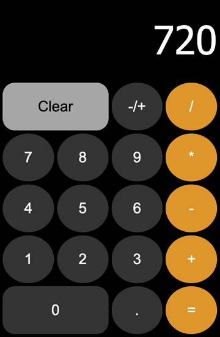

# _Calculator_

#### This is a browser-based calculator app that draws its visual style inspiration from the iOS calculator app on iPhones.

#### _05/2021_

#### By _**Chris Korsak**_

## Description

This calculator application was the final project from [The Odin Project](https://www.theodinproject.com/paths/foundations/courses/foundations/lessons/calculator) Javascript Foundations course. It has basic functionality (+, -, *, & /), and draws its visual style inspiration from the iOS calculator app on iPhones.

### Features
* Add, subtract, multiply, and divide
* Ability to input positive integers and decimal numbers
* Ability to calculate consecutive pairs of numbers ex. ( 2 + 45 * 6 / 3 = 94 )
* Clear button

## Setup/Installation Requirements

None. This is a web-based application hosted on Github pages. Check out the app [here!](https://chriskorsak.github.io/calculator-2021/)

## Technologies Used

* HTML
* CSS
* Javascript

## License

Copyright (c) 2021 **_Chris Korsak_** All rights reserved.
  
